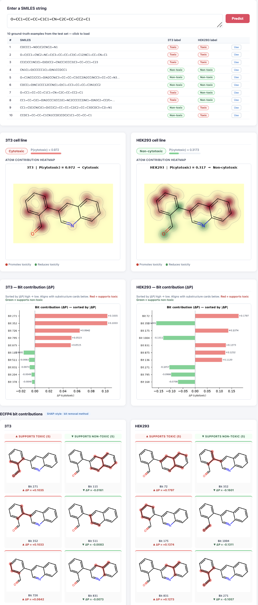

# CytoSafe — Cytotoxicity Prediction

QSAR model for cytotoxicity classification in 3T3 and HEK-293 cell lines using LGBM + ECFP4 fingerprints, with Riniker & Landrum XAI.

## Setup

```bash
conda env create -f environment.yml
conda activate cytosafe
```

## Repository structure

| Folder | Contents |
|---|---|
| `author_cytosafe/` | Original author's notebooks, datasets, and pre-trained models as published |
| `author_pipeline/` | Original author's reusable pipeline functions (`utils_binary.py`, `utils_fp.py`) |
| `reproduction/` | Our reproduction pipeline — data, fingerprints, training, evaluation, web app |

## Reproduction

All scripts are in `reproduction/scripts/`. Run in order:

**1. Generate fingerprints**
```bash
# Run reproduction/scripts/03_fingerprints.ipynb
# Reads from author_cytosafe/Datasets/ and writes to reproduction/data/fp/
```

**2. Train models** (~1 hour per cell line)
```bash
python 04_train_lgbm.py --dataset 3T3
python 04_train_lgbm.py --dataset HEK293
# Models saved to reproduction/model/
```

**3. (Optional) Evaluate against paper Table 1**
```bash
# Run reproduction/scripts/05_evaluation.ipynb
```

**4. Start the web app**
```bash
bash 07_start_web_server.sh
# Open http://localhost:5050
```

The web app accepts any SMILES string and returns the cytotoxicity prediction, atom-level heatmap, and top contributing molecular fragments for both cell lines.

